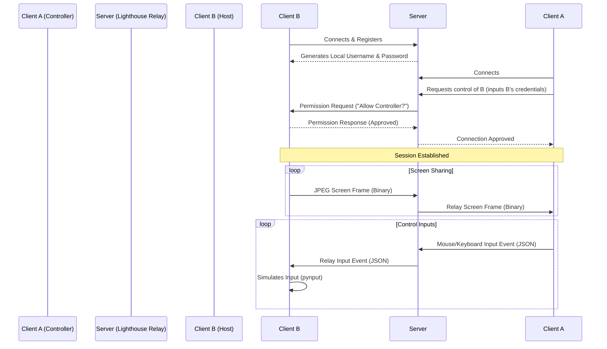

# Freeskoden Lighthouse

Freeskoden Lighthouse is a lightweight, secure remote control application built using Python, CustomTkinter, and WebSockets. It features a client-server-client architecture where a centralized server acts as a coordinator and traffic relay (Man-in-the-Middle) between two clients.

This version is 100% permissively licensed (MIT) and is compliant with legal standards for freeware/donateware.

---

## Architecture Flow



---

## Folder Structure

```
Freeskoden Lighthouse/
├── client/
│   ├── app.py           # Main GUI Application (CustomTkinter)
│   ├── capture.py       # Desktop Capture & Input Simulator
│   ├── connection.py    # Background WebSocket Client Loop
│   ├── settings.py      # App configurations & persistence
│   └── requirements.txt # Client dependencies
├── server/
│   ├── server.py        # WebSocket coordination & relay server
│   └── requirements.txt # Server dependencies
└── README.md
```

---

## Setup & Running

### 1. Installation

We recommend using a Python virtual environment to manage dependencies:

```powershell
# Create virtual environment
python -m venv venv

# Activate virtual environment
# On Windows (PowerShell):
.\venv\Scripts\Activate.ps1

# Install Client Requirements
pip install -r client/requirements.txt

# Install Server Requirements
pip install -r server/requirements.txt
```

### 2. Running the Coordination Server

Start the WebSocket server on the default port `8765` (or supply a custom port as a command line argument):

```powershell
python server/server.py [port]
```

### 3. Running the Clients

Launch two separate instances of the client:

```powershell
python client/app.py
```

1. **Check connection status**: Ensure both clients show `Connected to server` in the bottom-left corner status bar. (By default, they connect to `localhost:8765`. If the server is on a different machine, edit this in **Settings**).
2. **Note Credentials**: Client B (the host machine to be controlled) displays its generated credentials on the right side under **Remote Login**.
3. **Initiate Connection**: On Client A, enter Client B's **Local Username** and **Local Password** in the fields under **Remote Control** on the left side, then click **Connect to Client**.
4. **Approve Request**: Client B will receive a pop-up window asking for permission. Click **Allow**.
5. **Control**: A viewer window will open on Client A showing Client B's screen. You can now use your mouse and keyboard inside the viewer window to control Client B.

---

## Compiling & Packaging with Nuitka

To compile the server and client into standalone, compiled executables so the source code is protected and cannot be easily decompiled:

1. Install Nuitka and a C compiler (Nuitka will automatically prompt you to download one, or you can install MinGW/MSVC):
   ```powershell
   pip install nuitka
   ```
2. Compile the **Server**:
   ```powershell
   nuitka --standalone server/server.py
   ```
   This generates a `server.dist` directory containing the compiled Python server executable along with its required DLLs.
3. Compile the **Client**:
   ```powershell
   nuitka --standalone --windows-disable-console --enable-plugin=tk-inter client/app.py
   ```
   *Note: `--windows-disable-console` hides the command prompt window behind the GUI client, and `--enable-plugin=tk-inter` is required to bundle Tkinter components properly.*
   This generates an `app.dist` directory containing the compiled client GUI executable along with its required DLLs.
4. **Distribution**:
   For distribution, simply zip the respective `.dist` folder (e.g. rename it to `Lighthouse` or `Lighthouse Server` and zip it). This folder-based standalone distribution starts up much faster and avoids dropper-like heuristic false positives in antiviruses.

---

## Licensing
This project is licensed under the MIT License - see the source files for copyright notices. Free for commercial, freeware, or donateware usage.
